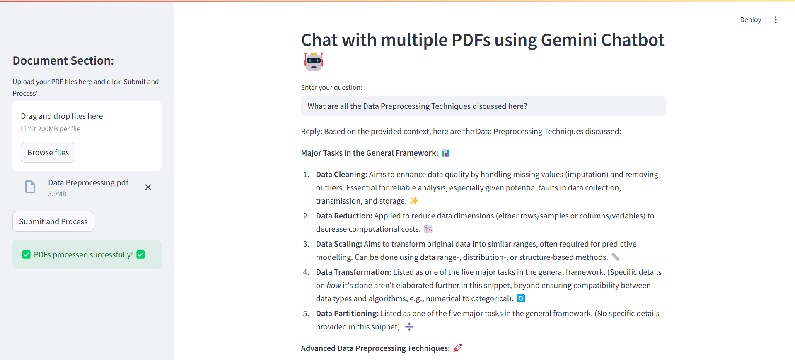

# 🅰️ℹ️ Gemini Chatbot 🤖

A 🧠 RAG-based project using the **`gemini-2.5-pro-exp-03-25`** pretrained LLM to answer questions from custom documents.

---

## 📁 Folder Structure

-    🛡️ `.env` — Stores the 🔐 Google API Key
-    🐍 `app.py` — Main script that runs the chatbot logic
-    📦 `requirements.txt` — All the 🧩 libraries required
-    🧪 `Test_API_Connection.py` — Tests 🔗 connection to Gemini LLM via API
-    📁 `faiss_index` — Stores the files uploaded during the session _(automatically deleted after the app is closed)_
     -    📄 `docs.json` — Stores the chunked texts
     -    🧠 `embeddings.npy` — Stores the vector embeddings of the text

---

## 🚀 How to use?

Run the following command in the **`RAG`** environment:

```bash
streamlit run .\app.py
```


